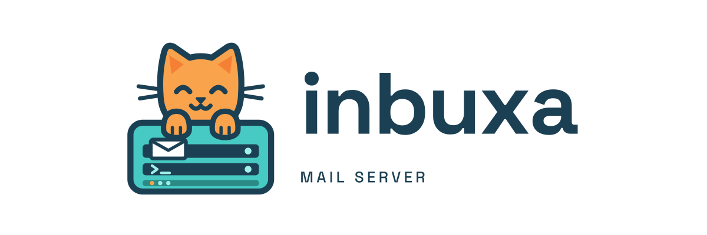

<p align="center">
  
</p>

<h3 align="center">INBUXA Admin</h3>

<p align="center">
  <a href="LICENSES/AGPL-3.0-only.txt"></a>
  <a href="https://git.coffeylabs.org/inbuxa/inbuxa-admin/releases/latest"></a>
  <a href="https://docs.inbuxa.org/install/admin/"></a>
  <a href="https://community.coffeylabs.org/c/inbuxa/5"></a>
  <a href="https://discord.gg/nqcY4TKfAn"></a>
</p>

> [!NOTE]
> Development happens on [git.coffeylabs.org/inbuxa/inbuxa-admin](https://git.coffeylabs.org/inbuxa/inbuxa-admin); the copy on GitHub is a read-only mirror.
> Report issues at **[git.coffeylabs.org/inbuxa/inbuxa-admin/issues](https://git.coffeylabs.org/inbuxa/inbuxa-admin/issues)**, join discussions at **[community.coffeylabs.org](https://community.coffeylabs.org)**, or chat on **[Discord](https://discord.gg/nqcY4TKfAn)**.

The administration interface for the INBUXA mail server: every server setting,
first-boot setup, and recovery, in the browser.

It is schema-driven. After signing in it fetches the server's schema and
builds every form, list and menu from it, so it covers every setting the
server has without hardcoding any of them.

## Design

- **One edition.** Every feature the server has is available here, with
  nothing held back. See the INBUXA server's `docs/spec/`.
- **Runs anywhere, not on the mail server.** INBUXA Admin is its own
  deployment, never installed onto the mail server. It's pointed at the server
  either at build time (`VITE_API_BASE_URL`) or at deploy time:
  `<meta name="api-base-url" content="https://mail.example.com">` in
  `index.html`. Hosted like that, it signs in as the OAuth client
  `inbuxa-admin`, which the server registers when it's started with
  `INBUXA_ADMIN_URL` set to INBUXA Admin's address (for development,
  `http://localhost:5173`).
- **INBUXA's look:** the logo and ihasmail's palette.
- **Two-factor setup** names INBUXA as the issuer, and no longer makes
  authenticator apps fetch a logo from a third-party site.

## Developing

```bash
npm ci
npm run dev          # http://localhost:5173, against VITE_API_BASE_URL in .env.development
npm run typecheck && npx eslint src/ && npx vitest run
npm run build
```

## Keeping up with upstream

The upstream codebase's history contains no code under a proprietary license,
so this is an ordinary git fork. `upstream` is a fetch-only remote:

```bash
git fetch upstream --tags
git merge v1.0.12        # the next release tag
```

## Versions

INBUXA Admin has its own dated version (`inbuxa-version.json`), shown with the
upstream release it's based on: `INBUXA Admin 2026.9.18 (base 1.0.11)`.
`package.json` keeps upstream's version, so upstream's bumps merge cleanly.

## Source code

Every build carries its own source. The interface links to it (the user menu
and the sign-in page), and the build writes it next to the app as
`source.tar.gz`: the exact tree the running version was built from.

## License and credits

Free software under the [GNU Affero General Public License, version 3](./LICENSES/AGPL-3.0-only.txt).

INBUXA Admin is forked from the upstream AGPL-3.0 web administration codebase
originally developed by Stalwart Labs. Their copyright notices are kept on
every file inherited from it, and INBUXA's own notice is added to the files it
changes. Those files are offered upstream under the AGPL-3.0-only or a
proprietary license. INBUXA uses them under the AGPL-3.0 only. INBUXA isn't
affiliated with or endorsed by Stalwart Labs.
